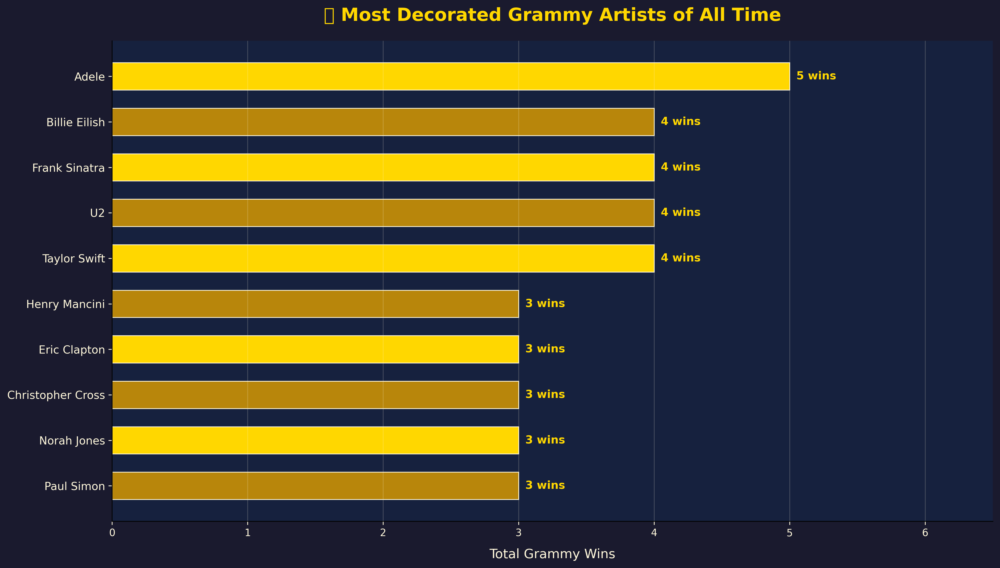
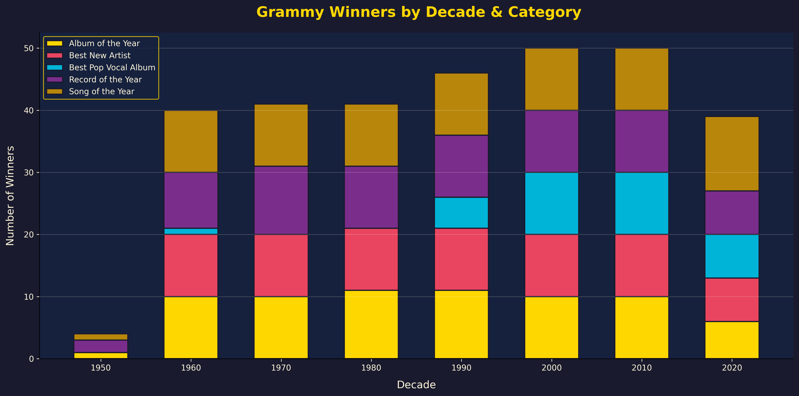
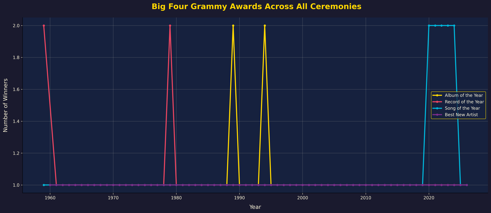
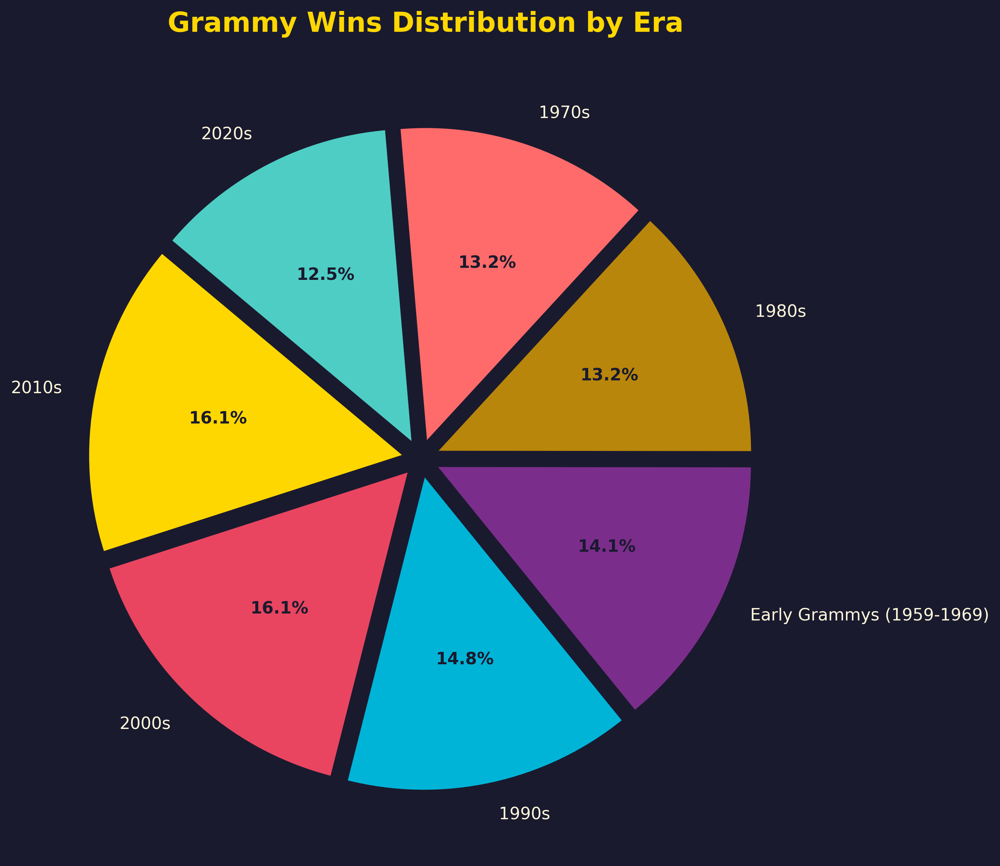
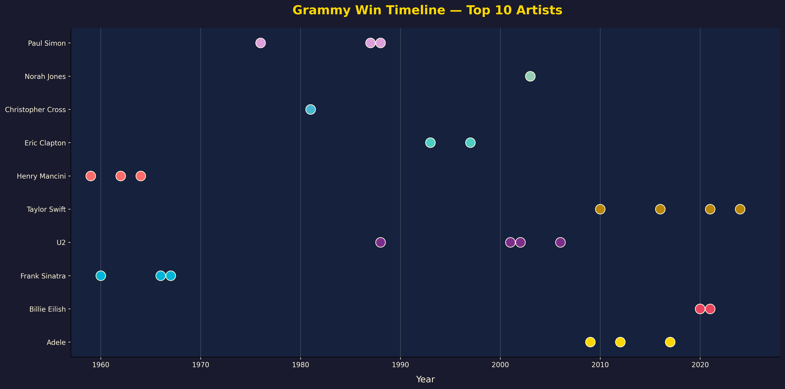

#  The Grammy Effect — 1959–2026

> **65 years of music's most coveted night, decoded through data.**

An end-to-end data analysis and visualization project exploring every Grammy Award winner across **68 ceremonies** — from Bobby Darin in 1959 to Bad Bunny in 2026. The project spans static charts, an interactive Dash dashboard, and a polished standalone HTML presentation.

---

## 📸 Preview

| Top Artists | Winners by Decade |
|:-----------:|:------------------:|
|  |  |

| Big Four Over Time | Era Distribution |
|:------------------:|:----------------:|
|  |  |

| Artist Win Timeline |
|:-------------------:|
|  |

---

##  Key Findings

| # | Insight |

 **Adele reigns supreme** — 5 Big Four wins (2009–2017), more than Sinatra, U2, or Taylor Swift |
 **2000s & 2010s produced the most winners** — 50 each, driven by category expansion |
 **Song of the Year is growing** — recent ties reflect streaming's impact on what counts as a "hit" |
 **Best New Artist launches careers** — Billie Eilish, Adele, and Norah Jones all started here |
 **Genre diversity is rising** — the 2020s already span Latin, R&B, and Pop winners |
 **Repeat winners are rare** — 80% of artists won only once (55 of 256 won multiple times) |

---

##  Project Structure

```
grammy_project/
├── grammy_analysis.py         
├── grammy_dashboard.py         
├── grammy.html                 
├── FINDINGS.md                
│
├── Grammy_Awards_Winners_*.csv       
├── Grammy_Big_Four_Awards_*.csv     
├── Grammy_Top_Artists_*.csv          
├── Grammy_Winners_By_Decade_*.csv    
├── Grammy_Awards_Report_*.xlsx       
│
├── charts/                     
│   ├── 01_top_artists.png
│   ├── 02_winners_by_decade.png
│   ├── 03_big4_over_time.png
│   ├── 04_era_distribution.png
│   └── 05_artist_timeline.png
│
├── videos/
│   └── background.mp4          
│
├── .gitignore
└── README.md
```

---

##  Datasets


| File | Rows | Description |
|------|------|-------------|
| `Grammy_Awards_Winners_*.csv` | 311 | Every winner across 5 categories, 1959–2026 |
| `Grammy_Big_Four_Awards_*.csv` | 279 | Album / Record / Song of the Year + Best New Artist |
| `Grammy_Top_Artists_*.csv` | 21 | Artists ranked by total Big Four wins |
| `Grammy_Winners_By_Decade_*.csv` | 37 | Winner counts by decade and category |

**Columns include:** `Year`, `Ceremony_Number`, `Decade`, `Era`, `Category`, `Award_Group`, `Winner`, `Artist`, `Total_Wins`, and more.

---

##  Getting Started

### Prerequisites

- Python 3.10+
- pip

### Installation

```bash
# Clone the repo
git clone https://github.com/<your-username>/grammy_project.git
cd grammy_project

# Install dependencies
pip install pandas matplotlib seaborn plotly dash openpyxl
```

### Generate Static Charts

```bash
python grammy_analysis.py
```

Outputs 5 high-resolution PNGs to the `charts/` folder.

### Launch the Interactive Dashboard

```bash
python grammy_dashboard.py
```


### View the Standalone Presentation

Open `grammy.html` in any modern browser Features:
- Background video hero section
- Scroll-triggered animations
- Chart.js interactive charts
- Responsive design

---

## 🛠 Tech Stack

| Layer | Tools |
|-------|-------|
| **Data Collection** | Python, pandas, Wikipedia |
| **Static Charts** | matplotlib, seaborn |
| **Interactive Dashboard** | Plotly, Dash |
| **Standalone Presentation** | HTML5, CSS3, Chart.js |
| **Styling** | Google Fonts (Playfair Display, Cormorant Garamond, Montserrat) |

---

## 📈 Charts Generated

1. **Top 10 Most Decorated Artists** — Horizontal bar chart of all-time Grammy leaders
2. **Winners by Decade & Category** — Stacked bar showing how award counts evolved
3. **Big Four Awards Over Time** — Line chart tracking the four most prestigious categories year by year
4. **Era Distribution** — Pie/donut chart of wins across music eras
5. **Artist Win Timeline** — Scatter plot showing when top artists claimed their wins

